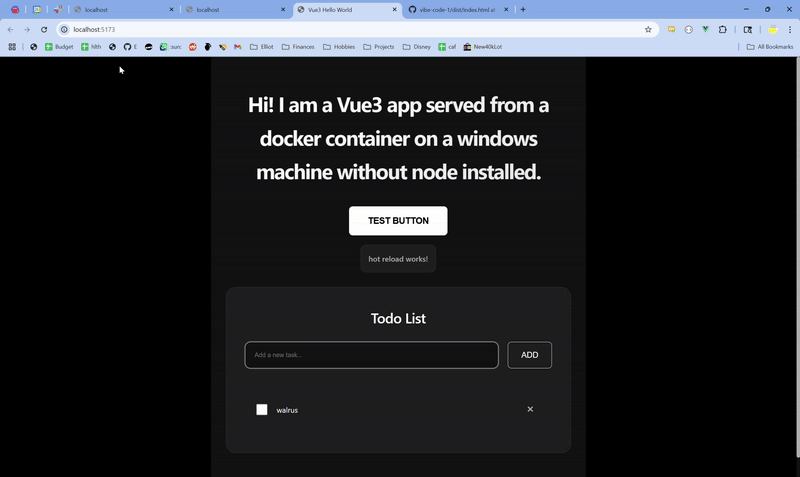

# WINDSURF VIBE CODING MAXIMUM COMDEDY:

app lives at: http://localhost:5173/

* Asked Windsurf to create app containerized app with Vue around 10:30am
* It did, eventually
* Now trying to move app to WSL directories which is ambitious
* That was dumb and wrong, gave up.
* Got git and SSH keys working in windows, now pushed as hoped to https://github.com/eqmvii/vibe-code-1
* lfg 
* Well that was a long walk. Ran in circles with a completely insane and broken dockerfile and dockercompose "architecture." Deleted everything and rebuilt one small prompt at a time and got there. Now 12:19pm, got some food. 
* switched to chat mode, it tried chatting with me and adding random features but couldn't edit code. It seemed to think it could? 5 billion app lfg
* Make it pretty: "Now let's style the whole app. Please make it black and white and grey, futuristic looking, like an apple product released in 2030."



VVV boilerplate spat out from Vue3 and Windsurf below VVV

# Vue3 Hello World App

A simple Vue3 application running in a Docker container.

## Prerequisites

- Docker Desktop
- Docker Compose

## Getting Started

1. Build and run the application:
```bash
docker-compose up --build
```

2. Access the application at http://localhost:8080

## Project Structure

- `src/` - Source code directory
- `index.html` - Main HTML file
- `package.json` - Node.js dependencies
- `Dockerfile` - Container configuration
- `docker-compose.yml` - Service configuration

